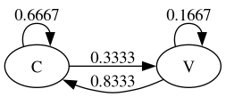

# Markov Chain Exploration

The people behind the Veritasium YouTube channel
made a video about
[Markov Chains](https://www.veritasium.com/videos/2025/12/25/the-strange-math-that-predicts-almost-anything).

These are the programs I wrote to verify that they were telling the truth.

### Choose letters randomly

This program generates text using a given probability of
choosing a consonant.
The generated text is a series of `a` (a vowel) or `b` (a consonant)
characters.

```
$ go build genletters.go
$ ./genletters -cons 0.6274 -letters 10000 > output
```

The example command line will create a file with 10,000 letters,
all 'a' or 'b'.
About 62.74% (6,274) of the letters will be `b`,
the rest `a`.

The probability of choosing a vowel is 1.00 - consonant probability.

### Count overlapping pairs of letters

```
$ go build paircounter.go
$ ./paircounter < output // or
$ ./paircounter output
```

The `paircounter` program counts letters as consonants or vowels.
It looks at pairs of letters, and counts the 4 categories of pairs
(CC, CV, VV, VC).

As an example, the string `the quick brown fox jumps`
has overlapping pairs th, he, eq, qu, ui, ic, ck, kb,
br, ro, ow, wn, nf, fo, ox, xj, ju, um, mp, ps.
That's  10 CC pairs,
5 CV pairs, 1 VV pair ("ui") and 5 VC pairs.

The output of `paircounter` looks like this:

```
$ echo "the quick brown fox jumps" | ./paircounter
total letters 21
consonants 15 (0.7143)
vowels     6 (0.2857)

CC 10 (0.6667)
CV 5 (0.3333)
VV 1 (0.1667)
VC 5 (0.8333)
21 total pairs
```

`paircounter` can also produce [Dot](https://graphviz.org/doc/info/lang.html)
format output,
suitable for use with [graphviz](https://graphviz.org/)
graph layout programs.

```
$ echo "the quick brown fox jumps" | ./paircounter -g > fox.dot
$ dot -Tpng -o fox.png fox.dot
```

The image `dot` generates is the "tranisiton diagram"
of the text.


